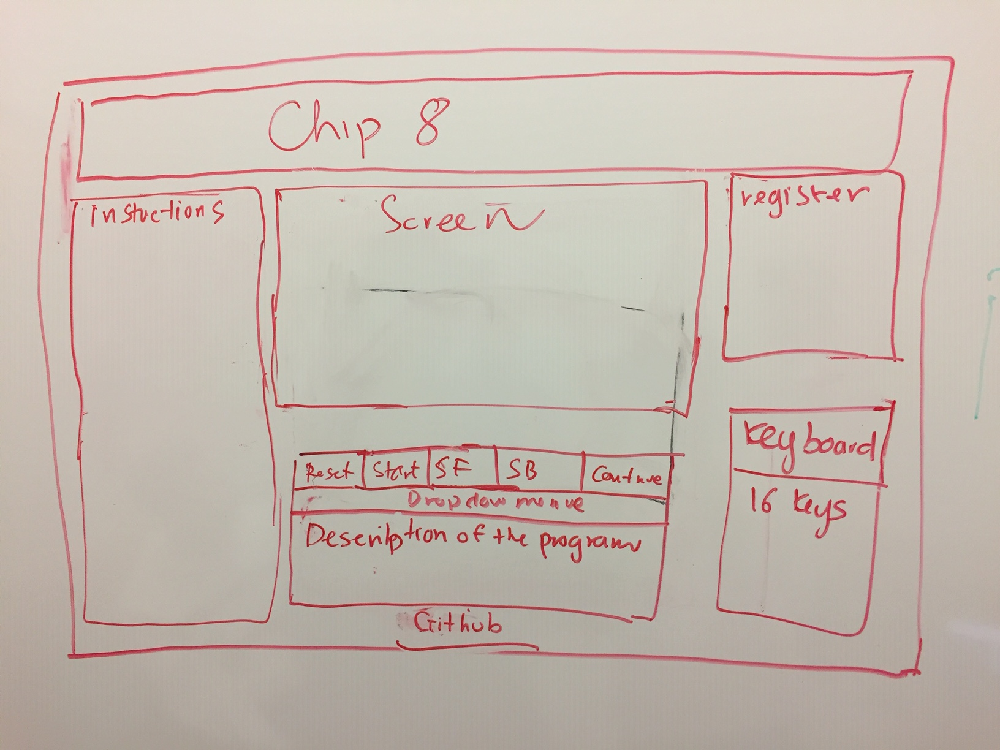
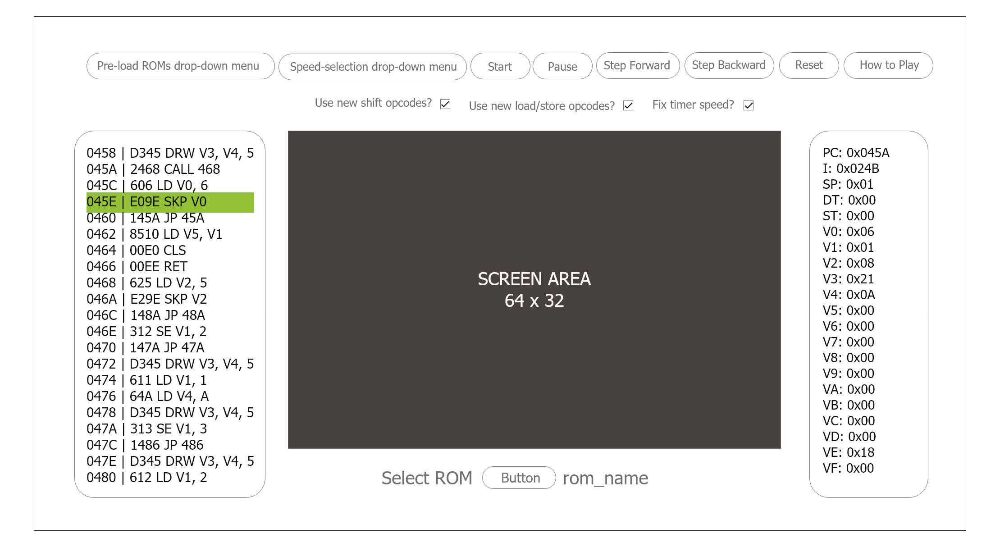
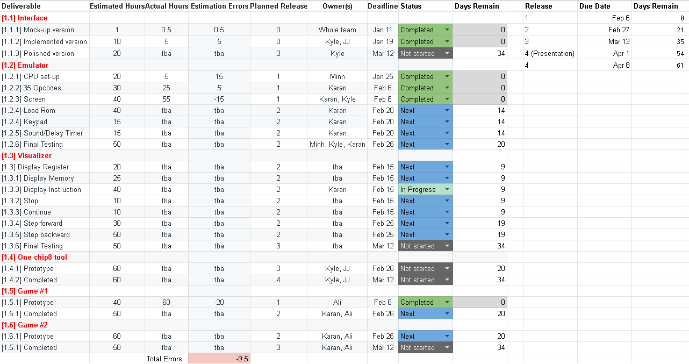
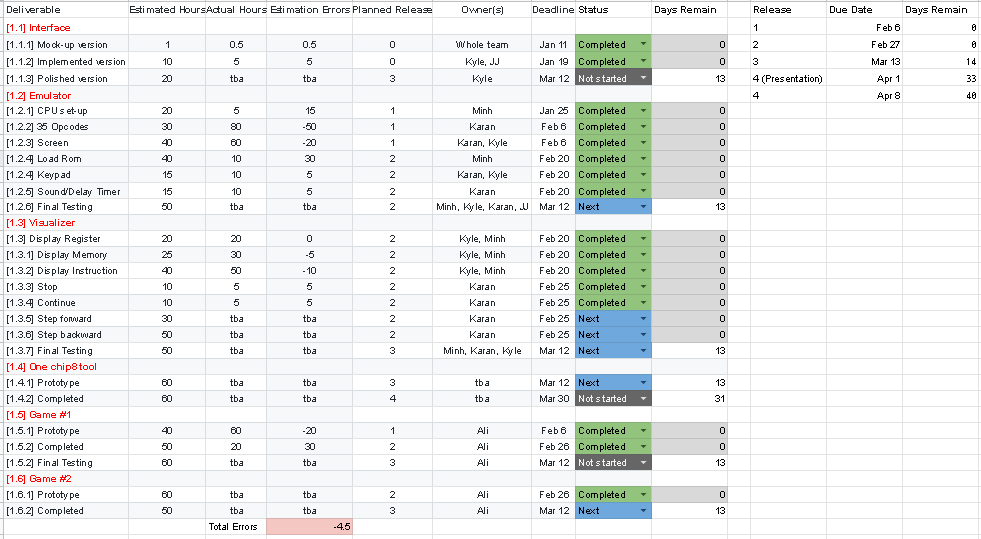
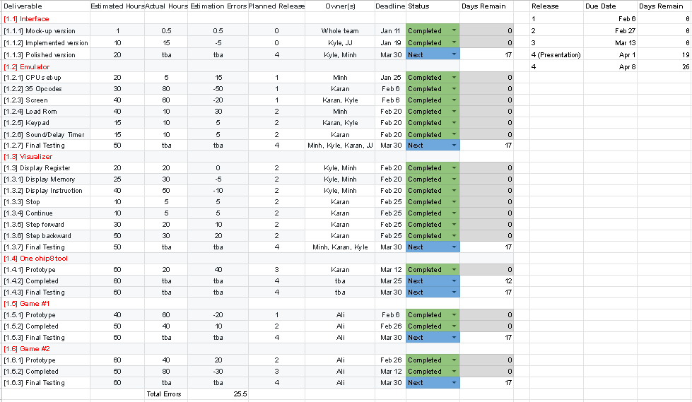
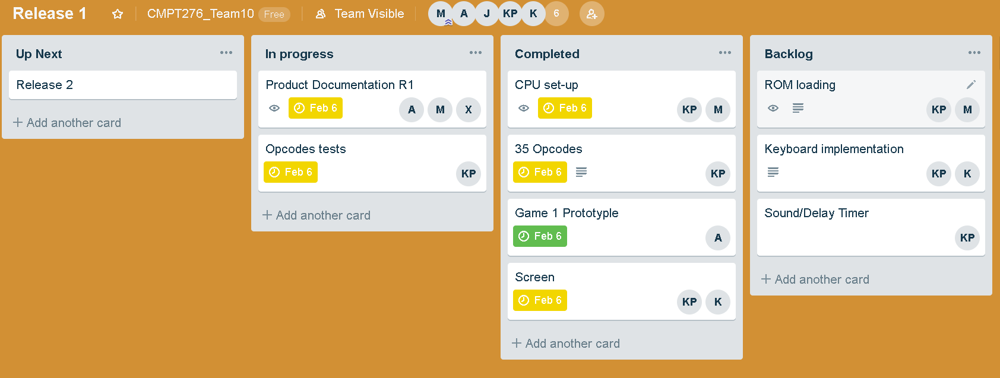
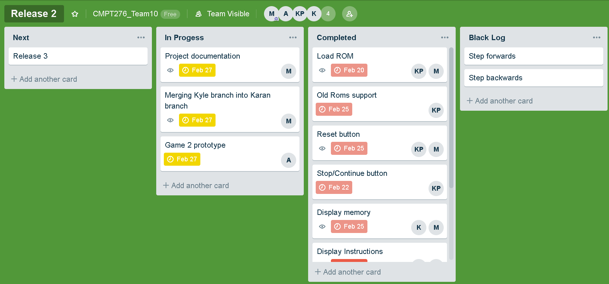
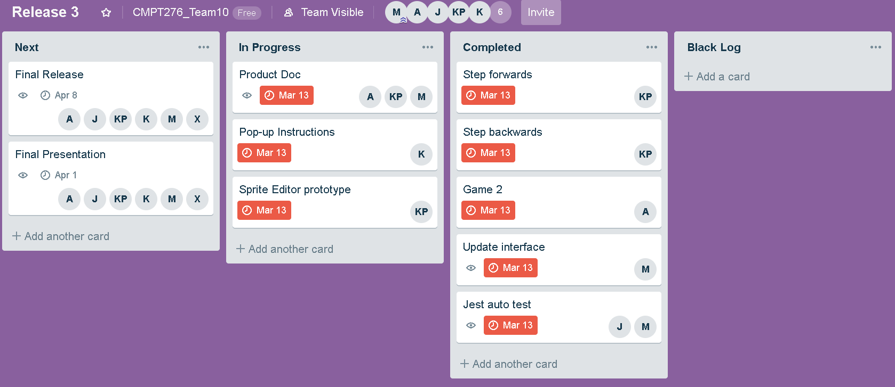

# Project: A JavaScript Chip8 System (JS-Chip8)

## Introduction 

**JS-Chip8** is a single-page JavaScript web application. It supports two browsers (Google Chrome and Mozilla Firefox) running on desktop only. **JS-Chip8** has the following components:

1. Chip8 **Emulator** can run any Chip8 program.
2. Chip8 **Visualizer** shows a Chip8 program in action. It displays memory, registers and instructions being executed. It lets users pause and step-forward/step-backward one instruction at a time.
3. One Chip8 **Tool**: `Sprite Editor` provides a visual interface to create sprites.  
4. Two Chip8 **Games**:  Game 1: `Space War`; Game 2: `Jumpy Rabbit`. The games are written in Chip8 language. They should be polished. Code reuse with proper citation are allowed but the majority (90% of code lines) should be written by the team.

## Project organization

### Software methodology 

We follow Extreme Programming methodologies for this project. The project startup plan (release 0 product documentation) includes limited information about the work breakdown and project schedule. During development, for each release, an informal project plan and effort estimates are created with involvement from all team members (Sommerville, Software Engineering, 9th Edition). 

The team will meet weekly to create user stories. The stories are ranked by importance and each story is assigned some effort points to indicate how much effort it will take, relative to other stories. At the beginning of each release, the team decide what user stories to implement and more detailed tasks are created for those stories. After each release, team velocity (i.e., how many effort-points per working day the team got done) and use as input for planning of the next release. Members chose what stories they want to work on rather than being assigned some stories to ensure personal accountability and create motivation. 

### Members' roles

**UPDATED January 20, 2019**: Add Xinyue Ma as a front-end programmer. 

The team has 6 Computer Science undergrads with the following roles:

1. Project manager: Minh Bui is responsible for scheduling team meetings, booking rooms and producing meeting memos. 
2. Front-end programmers: Kyle and Jong Joon Lee and Xinyue Ma work on the interface of the application, after they are done, they will join the back-end team. 
3. Back-end programmers: Minh Bui, Karan Pathania, and Ali Danapour are in charge of implementing the emulator, visualizer, the games and one tool. 
4. Testers: For unit testing, members are responsible for testing their own code. Once unit testing is done, integration testing requires collaboration between all members.

Note: The 6th member, Xinyue Ma has been recently added to the team on January 17, Minh has reached out to him/her on the same day and just got a response on January 18.

### Communication Plan 

#### Semester meeting Schedule with communication tools and techniques

|   MODE	|   TIME	|   TOOL|
|:-:	|:-:	|:-:	|
| In Person 	|  Weekly Monday/Friday, 12:30PM-2:30PM	|   Book room if needs whiteboard	|
|  Voice Call 	|   Tentative (mostly weekends)	|   Discord	|
|  Messages 	|   Daily	|   Slack	|
|  Urgent 	|   When needed	|   Phone call	|

NO-SHOW RULE: For pre-scheduled meetings (either in person or voice call), if a member anticipates that he/she will show up late or cannot show up at all, a notification must be posted in the #meetings channel in the Slack workspace at least 15 minutes in advance. If no notification is sent, members will wait for the missing member(s) for 10 minute before starting the meeting. 

## Use Cases For Major Features

**UPDATED February 6, 2019**: 
- Release 1: 
    - Added more detailed use case for game 1 prototype.
    - Implemented all 35 opcodes instead of splitting them between release 1 and 2.
    - Added use case for the screen.
    - Added use case for the decode opcode.
    - Moved keyboard/sound/delay implementation to release 2 due to underestimation of time needed to implement the screen and game 1 prototype. 
- Release 2:
    - Added use cases for remaining features of the emulator: Keyboard, Sound & Delay timer, ROM loading.
    - Added use cases to the visualizer.
    - Added use cases to the game 2 prototype and game 1 completed.
    - Moved chip8 tool prototype to release 3.

**UPDATED February 26, 2019**:
- Release 2:
    - Added [support for old ROMs](https://github.com/tomdaley92/Kiwi8/issues/9).
    - Updated user case for game 1 complete.
    - Added user case for game 2 prototype.  
    - Moved visualizer step forward and step backward to release 3.
    - Added test cases to `test.js`.  
- Release 3:
    - Added user case for chip8 tool prototype.
    - Added user case for game 2 complete.
    - Migrated to [Jest](https://jestjs.io/) for automated test.
    - Added program descriptions and instructions on how to play games to the visualizer.

**UPDATED March 13, 2019**:
  
- Release 3: 
    - Updated user case for chip8 tool prototype.
    - Updated user case for game 2 complete.
- Release 4: 
    - Added new interface mockup for emulator and visualizer. 
    - Added user case for chip8 tool complete.

**Release 0**:

- Interface Mockup

- Interface Implementation: implemented the interface based on the mockup version. 

**Release 1**

- CPU set-up: At the beginning or when the emulator resets, the memory, stack, registers will have some default values. 
- 35 Opcodes: Correctly implement 35 opcodes based on the specifications in [Cowgod's chip8 reference](http://devernay.free.fr/hacks/chip8/C8TECH10.HTM), according to Cowgod, opcode `0nnn` is only used on old computers and is ignored by modern interpreters so we don't implement it.
- Decode opcode: This feature is a part of the visualizer's instruction display deliverable and has been developed ahead of time. For now, users can simply enter any opcode (say 00E0) and click `Submit` which will print the corresponding instruction onto the page.

- Screen: The screen is 640x320 pixels and each pixel is rendered by a factor of 10. Only the welcome screen is shown for programs that require user interactions via the keyboard.

- Prototype of game 1: `Space War` a shooting game based on the classic game ‘Outlaw’.  
    
**Release 2**

- Emulator 
    - ROM loading: In release 1, the ROMs are pre-loaded into the memory. We will allow user to load any valid Chip8 ROM into the memory in release 2. 
    - Keyboard input: The 16-key keyboard used for input will be mapped to the computer keyboard and will also be displayed on the web page according to the following mapping:

        1	2	3	C  ------>		1	2	3	4  
        4	5	6	D  ------>	    Q	W	E	R  
        7	8	9	E  ------>		A	S	D	F  
        A	0	B	F  ------>		Z	X	C	V  
    - Sound/Delay timer: The `CHIP8` object already contains `delayTimer` and `soundTimer`. We will add sound (played when the sound timer reaches 0) in this release and calibrate the delay timer with our emulator's frame rate.

- Visualizer: While a Chip 8 program is executing, the program will show all current values being stored in memory and in each register. The current running instruction is highlighted. User can also stop the program, and continue running the program. User can click the `Description and How To Play` button for more details on any program in the drop-down menu. 

- Game 1 Complete: User playing against a computer AI. Two spaceships shooting at each other with a destroyable barrier in the middle. This game will have levels and points, and can be played through multiple rounds against the AI. The game is based on the famous arcade game ‘Outlaw’, with tweaks made to it, such as levels, and points. 
    - Actors:
        - User
        - Input/Output interface 
        - Chip-8 Emulator 
    - Preconditions:
        - User has loaded the game onto a compatible chip-8 emulator
    - Normal Flow:
        1. The system will proceed to execute SpaceWars code.
        2. The system will display game information (score).
        3. The game will initialize.
        4. The game will place random objects (asteroids) on the field.
        5. Throughout the duration of the game, the user will provide directional inputs using their keyboard.
        6. Throughout the duration of the game, the user will provide fire and special ability inputs using their keyboard.
        7. Throughout the duration of the game, the system will show updated game state in real time.
        8. Throughout the duration of the game, the system will provide automatic movement and fire for enemy (AI) player.
        9. The enemy AI’s automatic movement will adjust to a harder difficulty depending on the score of the user.
        10. At the completion of the game (either user or enemy reaches a score of 3), the game will terminate.
        11. A screen indicating a win or loss condition will be displayed along with a prompt for a new game.
        12. If the user chooses to replay the game, the system will reset all values to default and a new game is played.

    - Alternate Flow:
        - i1. If user chooses not to replay game, system will display win/loss screen indefinitely. It will be up to the user to close the system or to load another program.

- Game 2 Prototype: `Jumpy Rabbit` : A game inspired by Google's *T-Rex Run*. We replaced the T-Rex with a rabbit. The premise of Jumpy Rabbit is simple, avoid all obstacles and get the highest score!
    - Actors:
        - User
        - Input/Output interface 
        - Chip-8 Emulator 
    - Preconditions:
        - User has loaded the game onto a compatible chip-8 emulator  
        - User has set the emulator speed to 30-40 cycles per second. 
    - Normal Flow:
    
        1. The system will proceed to execute Jumpy Rabbit code.
        2. User will select difficulty level and begin game.
        3. The game will initialize.
        4. The game will draw level, the player (rabbit), and level/score information.
        5. Throughout the duration of the game, the user will provide jump instructions for the rabbit using their keyboard.
        6. Throughout the duration of the game, the system will spawn random enemies based on difficulty level.
        7. Throughout the duration of the game, the system will move the enemies to the left each frame.
        8. Throughout the duration of the game, the system will draw the rabbit in the appropriate place depending on if the rabbit is falling or jumping (via user input for the latter).
        9. Throughout the duration of the game, the system will update the score (+1 each time an enemy is avoided).
        10. The game will terminate once the player fails to avoid an enemy displaying a blank screen due to prototype phase.
    - Known bugs to be fixed in the next release:
        - Some artifacts may appear when jumping (very rare)
        - Game ends prematurely due to said artifacts
        - Score count is incorrect after first point (wrapping issue, will be fixed when enemies properly implemented)
        - Game ends with a blank screen when you lose

**Release 3**

- Emulator: Perform more rigorous automated testings.

- Visualizer: User can step forward or step backward one instruction at a time.

- Game 2 Complete:
    - Fixed existing bugs
    - Randomized enemies appearing based on difficulty level selected
    - Aded visual improvements (Animation, etc)
    - Added Game over/Play again/Winning screen

- Chip8 Tool: `Sprite Editor` provide a visual interface to create sprites. Chip8 developers can turn pixels on/off in the editor and it will produce the corresponding hexcode for that sprites, thus making it easier to create sprites by letting developer visualize them. 

- Automated test with Jest: Implement existing test cases in `test.js` in Jest and add new test cases.

**Release 4** **TODO**
- Interface complete: The new interface for the emulator and visualizer are shown below:

- Emulator complete:
    - User can select a pre-loaded rom from the drop-down menu or load any a Chip-8 ROM by clicking the select ROM button below the screen. 
    - The Emulator proceeds to execute the program selected by the user. 
    - The Emulator can run a program at different speed (default speed is 8 cycles/frame), user can select the speed before a program starts running or dynamically change the speed while a program is running. 
    - `Use new shift opcodes?` and `Use new load/store opcodes?` are selected by default to [support for old ROMs](https://github.com/tomdaley92/Kiwi8/issues/9).

- Visualizer complete:
    - While a program is running, the Visualizer 
- Chip8 Tool complete: **TODO**

- Game 1 complete: 

- Game 2 complete: **TODO**

## Risk analysis

|   Description	|   Likelihood	|   Impact | Risk Management Strategy|
|:-:	|:-:	|:-:	|:-:	|
|Conflicts between members due to unbalanced workload | Medium	| High	| Let members pick their tasks so that everyone has the chance to work on something they like. For tasks that no one volunteers to take, members with the most relevant experience and availability will be assigned to them |
|Limited time to work on the project during the end of the semester 	| High	|High	|Members carefully plan their last 3 weeks of the semester and share it with others. At the beginning of each release, each member will update their end-of-semester schedule if needed   	|
|Inaccurate estimation of time needed for a task |Medium	|High	|Let member(s) who are responsible for the task do the estimation then multiply that value by 3, and keep track of the number of hours actually spent to ensure more accurate estimation next time	|
|Fail to deliver promised extra feature |Medium	| Medium	| Member must conduct sufficient research before proposing additional features for the tool and the two games and be realistic about their existing skills and availability, core features must always be prioritized|

## Hardware and software resource requirements

|   Purpose	|   Related App Components	|   Tools/Languages/Libraries |
|:-:	|:-:	|:-:	|
|Front-End Programming	| Website interface 	| HTML, CSS 	|
|Back-End Programming | Emulator, Visualizer, chip8 tool 	| JavaScript 	|
|Game Programming | 2 Chip8 games	| [Octo](https://github.com/JohnEarnest/Octo)  	|
|Automated tests |Emulator, Visualizer, chip8 tool |  JavaScript, Jest, Chrome, Firefox|
|Version control	| All components 	| Git, Github	|
|Communication	| All components 	| Slack, Discord, Phone	|
|Planning	| All components 	| [Trello](https://trello.com) for Kanban Board, Google Doc & Spreadsheet|

- Hardware: Members should bring their personal laptop for group meetings. For remote work, they can either work on laptop or desktop.

- Testing methods: Our team will aim for test-driven development. Developers will write unit testing friendly code and try to eliminate most bugs at early stages of development. Apart from manually testing code at each stage (by individual developers), we will perform a code review on all parts of the product before every release. For unit testing, every developer is encouraged to rigorously unit-test their code at each stage of development and no later than each subsequent release. We plan to use Jest to automate unit testing. For integrated and functional testing, our team will perform integrated testing before every release to make sure no bugs are overlooked and passed on to next releases. When the final product is +75% ready, manual functional testing will be performed using Google Chrome and Mozilla Firefox to ensure cross browser functionalities.

## Work breakdown 

The work breakdown and project schedule below are tentative and will be update after each iteration. We used the rule of thumb introduced in class: (informal estimate of time) * 3 to calculate the Estimated Efforts (hours). 

**UPDATED**: **January 25, 2019**: Started using Google Spreadsheet for Work Breakdown which allows easier replanning for future releases. 

[Link to Work Breakdown Spreadsheet](https://docs.google.com/spreadsheets/d/1HqADerMmskoAKjknKuDWZFQrG6OZgpwF0acj79XQYGA/edit?usp=sharing) 

**UPDATED**: **February 6, 2019**: Bellow is a snapshot of out current Work Breakdown Spreadsheet, taken on February 6, 2019.  

For Release 1, we underestimated the number of hours needed for some deliverables and overestimated the number of hours needed for other deliverables, the net effect is an underestimation of 9.5 hours (6%). We increased the estimated effort hours for all remaining deliverable by 6% and ask members to track their hours more carefully in future releases. 

As we implementing the emulator, we also adding new deliverables and modify existing deliverables. For example, instead of splitting the opcodes into between 2 releases, we decided to implement all of them in release 1 so that we can test any chip 8 program on our emulator. We also divided the emulator into more concrete subtasks such as: screen implementation and automate the room loading. We will continue updating this Work Breakdown for upcoming releases. 

**UPDATED**: **January 27, 2019**: Bellow is a snapshot of out current Work Breakdown Spreadsheet, taken on February 27, 2019.

For Release 2, we are making good progress, the Emulator and Game 1 is essentially completed and just need more testing. The visualizer and game 2 will be completed by the release 3. Even though we have reduced the errors in our time estimation, we still made some mistakes, one example is the unexpected increases in opcode implementations to support old ROMs. 

As our code base expands, we have attempted to improve our code quality. For example, we have experienced with loading rom directly from file, however since the file is on a local machine we must either (1) turn the local machine into a Web server  (2) change security for local files in a browser (access local file as `file:///example`). Both options require user to perform initial set-up on their machine to run our code so we decided to convert roms (in binary) into hex values for loading into memory later. For roms that are actively developed (game 1, game 2), user must use `load rom` rather than `dropdown menu` so that we don't have to update the `dropdown menu` 
every time a new version comes out more on this topic, please visit: [link1](https://github.com/mrdoob/three.js/wiki/How-to-run-things-locally)
or [link2](https://stackoverflow.com/questions/10752055/cross-origin-requests-are-only-supported-for-http-error-when-loading-a-local). We will continue to improve our code quality based on our own judgments and the TA's feedbacks. We will continue updating this Work Breakdown for upcoming releases.

**UPDATED**: **March 13, 2019**: Bellow is a snapshot of out current Work Breakdown Spreadsheet, taken on March 13, 2019.

**TODO**

## Project schedule

The due dates of major deliverables are shown in the table above. Detailed scheduling, progress tracking and updates are done using Kanban Board via [Trello](https://trello.com). 

**UPDATED February 5, 2019**: An example for release 1 is shown below:

**UPDATED February 27, 2019**: An example for release 2 is shown below:

**UPDATED**: **March 13, 2019**: An example for release 3 is shown below:

## Monitoring and reporting mechanisms

We will use Git and GitHub for version control. To minimize merging conflicts, members follow the following rules:

1. Fetch remote changes frequently to avoid big conflicts.
2. At most 3 members work off the same branch.
3. Instead of handling multiple feature branches, use feature flags.

Critical information is included in the project documentation and this documentation will be updated when more information is available. For detailed release planning and progress tracking, we will use Trello instead. For each task, the member who is responsible for the task must track the number of hours he/she spends on it to improve effort estimation of tasks in the next release. With Trello, members can add notes to thier tasks. 

In the case of re-planning, if the re-planning results in delay of critical features, an in-person meeting must be held as soon as possible to discuss the following points:

1. Which features are delayed to the next release?
2. What are the consequences of the delay(s)? 
3. Why have the features been delayed?
4. Is there any member who can take ownership of the abandoned features? 
5. Do the replanning if no one is available.

To minimize re-planning, each Friday, the project manager will check-in with owners of each story to see if they need/want assistance or if any forseeable events might cause delay to allow early detection of potential re-planning and take actions to prevent it.