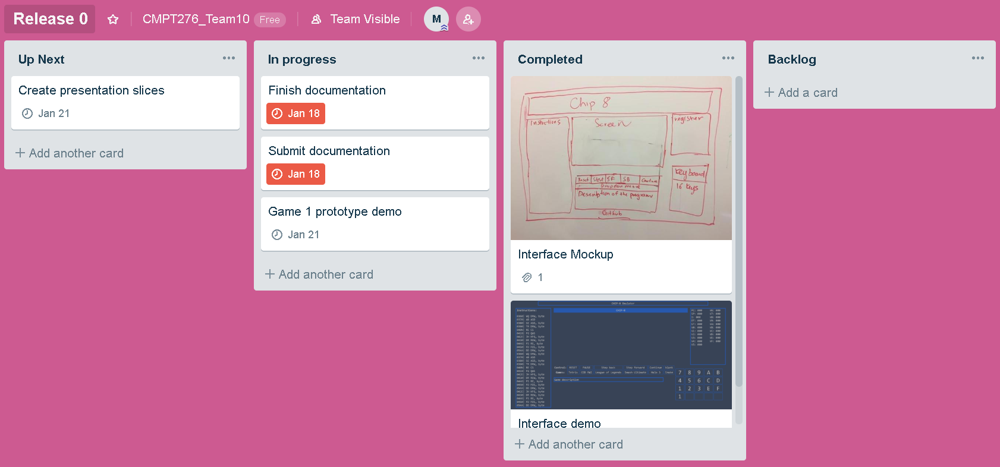

# Project: A JavaScript Chip8 System (JS-Chip8)

## Introduction 

**JS-Chip8** is a single-page JavaScript web application. It supports two browsers (Google Chrome and Mozilla Firefox) running on desktop only. **JS-Chip8** has the following components:

1. Chip8 **Emulator** can run any Chip8 program.
2. Chip8 **Visualizer** shows a Chip8 program in action. It displays memory, registers and instructions being executed. It lets users pause, step-forward or step-backward one instruction at a time.
3. One Chip8 **Tool**: *to be announced*. The goal is to build a Chip8 program that is useful to the intended users of the Chip8 emulator.  
4. Two Chip8 **Games**:  *to be announced*. The games are written in Chip8 language. They should be original and polished. Code reuse with proper citation are allowed but the majority (90% of code lines) should be written by the team.

## Project organization

### Software methodology 

We follow Extreme Programming methodologies for this project. The project startup plan (release 0 product documentation) includes limited information about the work breakdown and project schedule. During development, for each release, an informal project plan and effort estimates are create with involvement from all team members (Sommerville, Software Engineering, 9th Edition). 

The team will meet weekly to create user stories. The stories are ranked by importance and each story is assigned some effort points to indicate how much effort it will take, relative to other stories. At the beginning of each release, the team decide what user stories to implement and more detailed tasks are created for those stories. After each release, team velocity (i.e., how many effort-points per working day the team got done) and use as input for planning of the next release. Members chose what stories they want to work on rather than being assigned some stories to ensure personal accountability and create motivation. 

### Members' roles

The team has 6 Computer Science undergrads with the following roles:

1. Project manager: Minh Bui is responsible for scheduling team meetings, booking rooms and producing meeting memos. 
2. Front-end programmers: Kyle and Jong Joon Lee work on the interface of the application, after they are done, they will join the back-end team.  
3. Back-end programmers: Minh Bui, Karan Pathania, and Ali Danapour are in charge of implementing the emulator, visualizer, the games and one tool. 
4. Testers: For unit test, members are responsible for testing their own code. Once unit test is done, integration test requires collaboration between all members.

**For Release 0, members has the following roles**:

- Minh Bui (Minh) consolidates members' input and is responsible for writing and formatting project documentation, and researching how to implement the Chip8 emulator and visualizer.
- Ali Danapour (Ali) and Karan Pathania (KP) create the prototype of Chip8 Game #1.
- Kyle Wu (Kyle) and Jong Joon Lee (JJ) code the interface of the application.
- Xinyue Ma has no role in release 0.  

Note: The 6th member, Xinyue Ma has been recently added to the team on January 17, Minh has reached out to him/her on the same day and just got a response on January 18.

**For Release 1**:

- **TODO: detailed use cases for all major features planned for the next release**

- **TODO: Member roles**

### Communication Plan 

#### Semester meeting Schedule with communication tools and techniques

|   MODE	|   TIME	|   TOOL|
|:-:	|:-:	|:-:	|
| In Person 	|  Weekly Monday/Friday, 12:30PM-2:30PM	|   Book room if needs whiteboard	|
|  Voice Call 	|   Tentative (mostly weekends)	|   Discord	|
|  Messages 	|   Daily	|   Slack	|
|  Urgent 	|   When needed	|   Phone call	|

NO-SHOW RULE: For pre-scheduled meetings (either in person or voice call), if a member anticipates that he/she will show up late or cannot show up at all, a notification must be posted in the #meetings channel in the Slack workspace at least 15 minutes in advance. If no notification is sent, members will wait for the missing member(s) for 10 minute before starting the meeting. 

## Risk analysis

|   Desciption	|   Likelihood	|   Impact | Risk Management Strategy|
|:-:	|:-:	|:-:	|:-:	|
|Conflicts between members due to unbalanced workload | Medium	| High	| Let members pick their tasks so that everyone has the chance to work on something they like. For tasks that no one volunteers to take, members with the most relevant experience and availability will be assigned to them |
|Limited time to work on the project during the end of the semester 	| High	|High	|Members carefully plan their last 3 weeks of the semester and share it with others. At the beginning of each release, each member will update their end-of-semester schedule if needed   	|
|Inaccurate estimation of time needed for a task |Medium	|High	|Let member(s) who are responsible for the task do the estimation then multiply that value by 3, and keep track of the number of hours actually spent to ensure more accurate estimation next time	|
|Fail to deliver promised extra feature |Medium	| Medium	| Member must conduct sufficient research before proposing additional features for the tool and the two games and be realistic about their existing skills and availability, core features must always be prioritized|

## Hardware and software resource requirements

|   Purpose	|   Related app components	|   Tool/Languages/Libraries name |
|:-:	|:-:	|:-:	|
|Front-End Programming	| Website interface 	| HTML, CSS 	|
|Back-End Programming | Emulator, Visualizer, chip8 tool 	| JavaScript 	|
|Game Programming | 2 Chip8 games	| [Octo](https://github.com/JohnEarnest/Octo)  	|
|Automated tests |Emulator, Visualizer, chip8 tool |  JavaScript, Jest, Chrome, Firefox|
|Version control	| All components 	| Git, Github	|
|Communication	| All components 	| Slack, Discord, Phone	|
|Planning	| All components 	| [Trello](https://trello.com) for Kanban Board, Google Doc & Spreadsheet 	|

- Hardware: Members should bring their personal laptop for group meetings. For remote work, they can either work on laptop or desktop.

- Testing methods: Our team will aim for test-driven development. Developers will write unit testing friendly code and try to eliminate most bugs at early stages of development. Apart from manually testing code at each stage (by individual developers), we will perform a code review on all parts of the product before every release. For unit testing, every developer is encouraged to rigorously unit-test their code at each stage of development and no later than each subsequent release. We plan to use Jest to automate unit testing. For integrated and functional testing, our team will perform integrated testing before every release to make sure no bugs are overlooked and passed on to next releases. When the final product is +75% ready, manual functional testing will be performed using Google Chrome and Mozilla Firefox to ensure cross browser functionalities.

## Work breakdown 

The work breakdown and project schedule below are tentative and will be update after each iteration. We used the rule of thumb introduced in class: (informal estimate of time) * 3 to calculate the Estimated Efforts (hours). 

|   Deliverable	|   Estimated Efforts (hours)	|   Actual Efforts (hours)  | Planned Release |Owner(s)| Deadline|
|:-	|:-:	|:-:	|:-:	|:-:	|:-:	|
|**[1.1] Interface**|	|	|	|	|
|[1.1.1] Mock-up version| 1 | 0.5  | 0	| Whole team	| Jan 11	|
|[1.1.2] Implemented version|10  | 5 	|0	| Kyle, JJ	|Jan 19	|
|**[1.2] Emulator**|    |	|	|  |
|[1.2.1] CPU set-up| 20 	|tba	| 1	| Minh | Jan 25 | 
|[1.2.2] Opcode implementation (1-13)| 40 	|tba	| 1	|Minh, Kyle, JJ, Xinyue | Feb 3  |
|[1.2.3] Opcode implementation (14-36)| 40 	|tba	| 2	|Minh, Kyle, JJ, Xinyue | Feb 20  | 
|[1.2.4] Input/Output/Sound Implementation| 15	| tba	|1	| Minh, JJ | Feb 3 | 
|[1.2.5] Final Testing| 30	| tba|1	|Minh, Kyle, JJ, Xinyue | Feb 26 | 
|**[1.3] Visualizer**|	|	|	|
|[1.3] Display Register Values|20	|tba	|2	|tba | Feb 15 | 
|[1.3.1] Display Memory| 25	|tba|2|tba | Feb 15 | 
|[1.3.2] Stop|10|tba|2|tba | Feb 15 | 
|[1.3.2] Continue|10|tba|2|tba | Feb 15 | 
|[1.3.4] Step forward|15|tba|2|tba | Feb 20 | 
|[1.3.5] Step backward (max 10 steps)|30 |tba|2|tba | Feb 20 | 
|[1.3.5] Final Testing|30 |tba|2| tba | Feb 25 | 
|**[1.4] One chip8 tool**| 	|	|	| 
|[1.4.1] Prototype| 50 	|tba	|2	| Kyle, JJ | Feb 26
|[1.4.2] Completed| 60 	|tba	|3	| Kyle, JJ | Mar 12
|**[1.5] Game #1**| 	|	|	|
|[1.5.1] Prototype| 40 	|tba	|1	| Karan, Ali | Feb 5
|[1.5.1] Completed| 50 	|tba	|2	| Karan, Ali | Feb 26
|**[1.6] Game #2**| 	|	|	|
|[1.6.1] Prototype| 50 	|tba	|2	| Karan, Ali | Feb 26
|[1.5.1] Completed| 50 	|tba	|3	| Karan, Ali | Mar 12

## Project schedule

The due dates of major deliverables are shown in the table above. Detailed scheduling, progress tracking and updates are done using Kanban Board via [Trello](https://trello.com). An example for release 0 is shown below:

## Monitoring and reporting mechanisms

**TODO** 

- Git/Github for monitoring code changes 
- Project documentation and slack 
