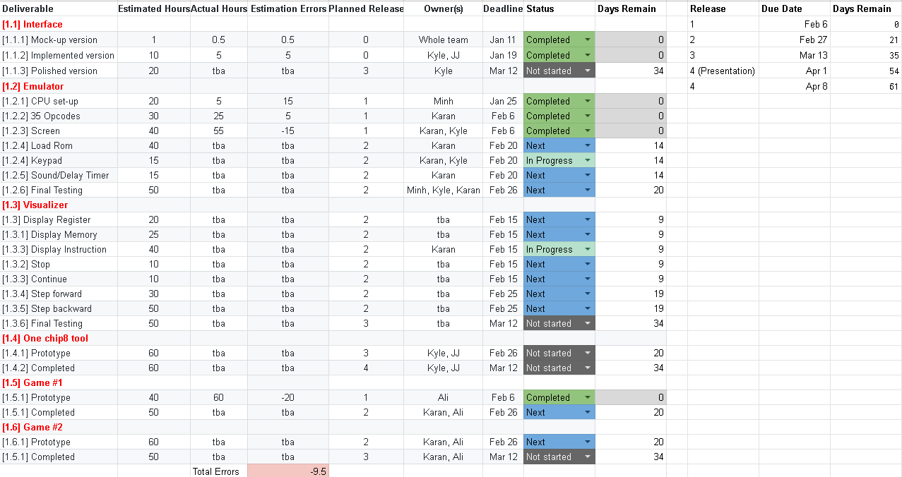

# Project: A JavaScript Chip-8 System (JS-Chip8)

## Introduction 

**JS-Chip8** is a single-page JavaScript web application. It supports two browsers (Google Chrome and Mozilla Firefox) running on desktop only. **JS-Chip8** has the following components:

1. Chip-8 **Emulator**: Run any compatible Chip-8 program.
2. Chip-8 **Visualizer**: View a Chip-8 program in action, displays memory, registers, timers, and instructions being executed. Also allows you to play/pause, step-forward/step-backward one instruction at a time, restart a current ROM or even reset the emulator.
3. One Chip-8 **Tool**: `Sprite Editor` provides a visual interface to create, view, and edit 8x15 sprites.
4. Two Chip-8 **Games**:  Game 1: `Space Wars`, based on the Atari classic game 'Outlaw'; Game 2: `Jumpy Rabbit`, based on the T-Rex Run by Google.

## What has changed since the last release:

### Changes in Release 4 (the last release):
- The `Sprite Editor` is now fully functional
- Added reload current ROM option so user can restart a ROM without having to reload it
- The `Fix timer speed?` checkbox is now unchecked by default
- Added buttons to change the Emulator's screen background and pixels colours
- Changes to the webpage interface: 
    - Removed text at the top of the webpage since it's no longer needed
    - Added animation to the CHIP8 logo  
    - Added favicon
    - Changed the colour of the webpage background, the Emulator's screen and the `Sprite Editor`'s screen
    - Changed the height of the Visualizer's instruction box and register box to match the height of the Emulator's screen
    - Renamed `Load ROM` button to `Load your ROM` and moved it to the left of the page
    - Renamed Emulator, Visualizer and Tool buttons' text to symbols with a short explanation of what a button does, displayed when user hovers over them
    - Renamed the `Description and How to Play` button to `?`. On clicking, a pop-up box (instead of a drop-down text box in earlier releases) shows up
    - The tool is hidden by default (if the screen size is small enough to allow) and revealed only on scrolling down; when user scrolls up, the tool is hidden again, and the current state of the tool is fully preserved
- Added Jest test cases for the tool

### Changes in Release 3:
- The Visualizer is now fully functional
    - `Step forward` and `Step backward` options are now fully functional
    - Visualizer's instruction box and register box are now fully functional
- Game 2 is now fully functional
- Added `Fix timer speed?` checkbox to support Game 2's usage of the delay timer and other ROMs
- Added `Sprite Editor` prototype
- Changes to the webpage interface: 
    - Moved the Visualizer's instruction box and register box next the Emulator's screen 
    - Moved the `Load ROM` button to the middle of the page
- Migrated to [Jest](https://jestjs.io/) for automated testing

### Changes in Release 2:
- The Emulator is now fully functional
    - Added [support for old ROMs](https://github.com/tomdaley92/Kiwi8/issues/9) via the `Use new shift opcodes?` and `Use new load/store opcodes?` checkboxes for opcodes 8XY6/8XYE and FX55/FX65
    - Added keyboard input, sound and delay timers
- Game 1 is now fully functional
- Added `Load ROM` functionality where user can load any Chip-8 ROM to the Emulator and run it
- Added `Description and How to Play` drop-down button prototype for preloaded ROMs. On clicking the button, a description and instructions on how to use the current preloaded ROM are displayed; when user clicks the button again, the drop-down text area is closed
- Added Visualizer's prototype
    - `Stop`, `Continue` and `Reset` buttons are now fully functional
- Removed unneeded decode opcode input field
- Added test cases for old ROMs support and created a separate CPU object for automated testing

### Changes in Release 1:
- Added  Emulator prototype
    - Implemented the screen and 35 opcodes
- Added use cases for the decode opcode feature
- Added Game 1 prototype
- Added automated testing, results shown in the tests output area

## Use Cases For Major Features

**Release 5**

- Release 4 is the final release of the `JS-Chip8` web application. Our team doesn't have any plans for another release since members will move on to other projects. However, assuming we actually have a Release 5, these are the features we would like to add:
    - Host the JS-Chip8 web application with a dedicated URL, so that we can collect more user feedback to improve the web app UX, UI
    - Make the web page responsive for mobile users 
    - Test for performance and security issues 
    - Refactor the existing back-end code from JavaScript to TypeScript for long-run maintenance
    - Add more tools to support Chip-8 developers  

**Release 4** 

- Emulator completed and interface polished:
    

    - User can select a preloaded ROM from the drop-down menu or load any compatible Chip-8 ROM by clicking the `Load your ROM` button below the screen. 
    - The Emulator proceeds to execute the program selected by the user. 
    - The Emulator can run a program at different speeds (default speed is set to 8 cycles/frame); user can select the speed before a program starts or dynamically change the speed while a program is running. 
    - `Use new shift opcodes?` and `Use new load/store opcodes?` are selected by default to [support for old ROMs](https://github.com/tomdaley92/Kiwi8/issues/9).
    - `Fix timer speed?` is unchecked by default to add support for Game 2 and for intuitive use. 

- Visualizer completed and interface polished:
    - While a program is running, the Visualizer will dynamically display the value for all 21 registers, and a list of 21 instructions with the current instruction highlighted.
    - While a program is running, the user can: 
        - Pause the program 
        - Resume the program 
        - Step forward or step backward one instruction at a time 
        - Reset the Emulator to its default state
        - Restart the current ROM (i.e., the user doesn't have to reload their ROM using the `Load your ROM` button or reselect a preloaded ROM from the drop-down menu to restart the current ROM which they had to do up until the last release) 
        - Display a pop-up screen with a description of the preloaded program selected from the drop-down menu and instructions on how to play the game

- Chip-8 Tool complete: `Sprite Editor` provides a visual interface to create, view, and edit 8x15 sprites, inspired by [Octo toolbox](http://johnearnest.github.io/Octo/):

    

    - User *left-clicks* on the screen area to turn pixels on or *right-clicks* to turn pixels off. The `Sprite Editor` will produce/update the corresponding hex values in the text box. To turn multiple pixels on/off, hold and drag the cursor. **Note**: Right-click-and-drag to turn multiple pixels off would require either a mouse or physical keys on the touchpad of a laptop. A touchpad without left and right keys would not be able to utilize this feature since most machines would recognize it as left-click-and-drag when you put two keys down and drag.
    - User can edit the hex values displayed in the text box area and the corresponding sprite will be displayed on the screen. Please note that the text box recognizes input in 'comma-delimited' hex format with required `0x` prefix.
    - User can also:
        - Reset the `Sprite Editor` (clear the screen and set the hex values to 0x00)
        - Move the existing sprites up (wrap around)
        - Move the existing sprites down (wrap around)
        - Move the existing sprites left (wrap around)
        - Move the existing sprites right (wrap around)

- Game 1 `Space Wars` complete: Fully completed game with polished interface and no known bugs.

- Game 2 `Jumpy Rabbit` complete: Fully completed game with polished interface and no known bugs.

**Release 3**

- Emulator: Perform more rigorous automated testings.

- Visualizer: User can step forward or step backward one instruction at a time.

- Game 2 Complete: `Jumpy Rabbit` is a game inspired by Google's *T-Rex Run*. We replaced the T-Rex with a rabbit. The premise of Jumpy Rabbit is simple, avoid all obstacles and get the highest score! 
    - Updates made to prototype:
        - Fixed existing bugs
        - Randomized enemies appearing based on difficulty level selected
        - Aded visual improvements (Animation, etc)
        - Added game over/Play again/Winning screen
        - Undesired sprites may appear when jumping (very rare) and doesn't stop the prematurely 

    - Actors:
        - User
        - Input/Output interface 
        - Chip-8 Emulator 
    - Preconditions:
        - User has loaded the game onto a compatible Chip-8 emulator  
        - User has set the emulator speed to 30-40 cycles per second
    - Normal Flow:
    
        1. The system will proceed to execute Jumpy Rabbit code.
        2. User will select difficulty level and begin game.
        3. The game will initialize.
        4. The game will draw level, the player (rabbit), and level/score information.
        5. Throughout the duration of the game, the user will provide jump instructions for the rabbit using their keyboard.
        6. Throughout the duration of the game, the system will spawn random enemies based on difficulty level.
        7. Throughout the duration of the game, the system will move the enemies to the left each frame.
        8. Throughout the duration of the game, the system will draw the rabbit in the appropriate place depending on if the rabbit is falling or jumping (via user input for the latter).
        9. Throughout the duration of the game, the system will update the score (+1 when level 1 enemy avoided. +2 for level 2/3 enemies avoided).
        10. If the player touches an enemy, the game will terminate display a game over screen with the score displayed.
        11. If the player reaches max score (20 - level 1, 100 - level 2, 255 - level 3), the game ends and displays a game win animation. The score of the player is also displayed.
        12. If the player chooses to play again via input, the game reinitializes and game flow resumes at point 'b'

- Chip-8 Tool: `Sprite Editor` provide a visual interface to create, view, and edit 8x15 sprites. Chip-8 developers can turn pixels on in the editor and it will produce the corresponding hexcode for that sprites, thus making it easier to create sprites by letting the developer visualize them. 

- Automated testing with Jest: Implement existing test cases in `test.js` in Jest and add new test cases.

**Release 2**

- Emulator 
    - ROM Loading: In Release 1, the ROMs are preloaded into the memory. We will allow user to load any valid Chip-8 ROM into the memory in Release 2. 
    - Keyboard Input: The 16-key keyboard used for input will be mapped to the computer keyboard and will also be displayed on the web page according to the following mapping:

        1	2	3	C  ------>		1	2	3	4  
        4	5	6	D  ------>	    Q	W	E	R  
        7	8	9	E  ------>		A	S	D	F  
        A	0	B	F  ------>		Z	X	C	V  
        
    - Sound/Delay Timer: The `CHIP8` object already contains `delayTimer` and `soundTimer` variables which represent the two timers. We will add sound (played when the sound timer reaches 0) in this release and calibrate the delay timer with our emulator's frame rate.

- Visualizer: While a Chip-8 program is being executed, all current values being stored in memory and in each register will be displayed. The current running instruction is highlighted. The `Pause` and `Continue` buttons can be used for flow control - to play or pause programs. The `Description and How To Play` button can be used for more details on any program chosen from the drop-down menu. 

- Game 1 Complete: User plays against a computer AI. Two spaceships shoot at each other with a destroyable barrier in the middle. This game will have levels and points, and can be played through multiple rounds against the AI. The game is based on the famous arcade game ‘Outlaw’, with tweaks made to it, such as levels, and points. 
    - Actors:
        - User
        - Input/Output interface 
        - Chip-8 Emulator 
    - Preconditions:
        - User has loaded the game onto a compatible Chip-8 emulator
    - Normal Flow:
        1. The system will proceed to execute SpaceWars code.
        2. The system will display game information (score).
        3. The game will initialize.
        4. The game will place random objects (asteroids) on the field.
        5. Throughout the duration of the game, the user will provide directional inputs using their keyboard.
        6. Throughout the duration of the game, the user will provide fire and special ability inputs using their keyboard.
        7. Throughout the duration of the game, the system will show updated game state in real time.
        8. Throughout the duration of the game, the system will provide automatic movement and fire for enemy (AI) player.
        9. The enemy AI’s automatic movement will adjust to a harder difficulty depending on the score of the user.
        10. At the completion of the game (either user or enemy reaches a score of 3), the game will terminate.
        11. A screen indicating a win or loss condition will be displayed along with a prompt for a new game.
        12. If the user chooses to replay the game, the system will reset all values to default and a new game is played.

    - Alternate Flow:
        - i1. If user chooses not to replay the game, system will display win/loss screen indefinitely. It will be up to the user to close the system or to load another program.

- Game 2 Prototype: `Jumpy Rabbit` is a game inspired by Google's *T-Rex Run*. 
    - Known bugs to be fixed in the next release:
        - Undesired sprites may appear when jumping (very rare) and game ends prematurely due to said artifacts
        - Score count is incorrect after first point (wrapping issue, will be fixed when enemies properly implemented)
        - Game ends with a blank screen when you lose

**Release 1**

- CPU set-up: At the beginning or when the emulator resets, the memory, stack, and registers will have suitable default values. 

- 35 Opcodes: Correctly implemented 35/36 opcodes based on the specifications in [Cowgod's Chip-8 Technical Reference](http://devernay.free.fr/hacks/chip8/C8TECH10.HTM). According to Cowgod's and other references, the opcode `0nnn - SYS addr` is only used on old computers and is ignored by modern interpreters, so we did not implement it and it has been confirmed not to interefere with any ROMs tested so far.

- Decode Opcode: This feature is a part of the visualizer's instruction display deliverable and has been developed ahead of time. For now, users can simply enter any opcode (say `00E0`) and click `Submit` which will print the corresponding instruction onto the page.

- Screen: Chip-8 originally has a 64x32 pixel screen and each pixel in our emulator has been scaled up by a factor of 10, making the screen 640x320 px. Only the welcome screen is shown for programs that require user interaction via the keyboard.

- Prototype of Game 1: `Space Wars` - a shooting game based on the classic Atari game ‘Outlaw’.

**Release 0**:

- Interface Mockup

- Interface Implementation: Implemented the interface based on the mockup version. 

## Project Post Mortem 

### Was this a suitable project for our team?
- Yes
    - Prior experience of some members using required technologies (JavaScript, Assembly and Git) so the learning curves was not too steep
    - Hands-on experience using JavaScript - the most popular programming language (Octoverse, 2018) 
    - Emulator development is new and exciting for all team members so our team was highly motivated to tackle this project
- No
    - Relatively small project for a team of six members, making it harder to modularize the project and divide tasks among members; we would have preferred a smaller team
    - Conflicting information about the emulator led to implementation dilemma 
    - No real client to interact with, which caused some design dilemmas. In retrospect, we could have overcome this by choosing concrete target users early on (e.g., high school students learning to code)

### Which tools did we find useful?

|   TASKS	|   USEFUL TOOLS	|   COMMENTS|
|:-:	|:-:	|:-:	|
|Communication	| Slack and In-person Meetings	| Slack provides integration with Git so members are notified of all commits, in-person meetings are important to ensure everyone is on the same page, take part in pair-programing, and resolve technical issues |
|Planning and Scheduling	|Google Sheets and Trello	| Both have a smooth learning curve and are easy to use. We used Google Sheets for high-level work breakdown and Trello to create smaller subtasks. |
|Version Control	|Git and GitHub	|At the beginning, we acted naive and used to merge members' code manually. However, as the code base become more larger and more complex, we migrated to Git and GitHub to save time, remove the hassle of merginng manually, and to reduce the possibility of bugs and problems later on.	|
|Test	|Google Developers Console, JavaScript, Jest	| We used Google Developers Console for live/interactive testing. We initially wrote test cases using JavaScript for quick-testing the emulator, and then translated them to Jest. |
|Front-End	|HTML/CSS	|We thought that we could refactor the entire interface using Bootstrap at the end, but it turned out to be a lot trickier than expected, which led us to decide to stick with the current interface. We realized that we should have used Bootstrap from the very beginning. |
|Back-End	|JavaScript	| We originally wanted to use TypeScript, but it added complexity to the learning curve, so we decided to use JavaScript instead. For larger and complex projects, we would like and recommend to use TypeScript due to type-checking to avoid bugs and problems later on. |
|Chip-8 Development	|Octo	|We used Octo to develop and test our two Chip-8 games to save time and effort. The online Octo IDE also provides various useful tools such as complier, sprite and audio editors. |

### What worked well in this project, and what didn’t?

|   TASKS	|   DECISIONS	| COMMENTS |
|:-:	|:-:	|:-:	|
|Project Management	| Assigned one team member to be the project manager	| HELP: The project manager performed important but tedious "bookkeeping" tasks such as: setting up communication channels, bookeing rooms for weekly team meetings, maintaining project documentation |
|Role Assignment	| Let members take on multiple roles	| HELP: Members freely moved between different roles, so when issues occurred, members could quickly help each other |
|Software Development	| Followed Agile Development, combined with sequential and parallel development	| HELP: Multiple releases reduced procrastination, and developing the Emulator and Visualizer at the same time as the two Chip-8 games helped us get more tasks done in lesser time |
|Test	|Develop tests in JavaScript, then migrate to Jest	| HELP: Using JavaScript to quickly test the initial Chip-8 emulator components before Jest helped use test our implementation faster 	|
|Refactor Interface	|Refactor using Bootstrap once we were done with everything	| HURT: The code base has dependencies between various components and adding a library/framework introduced weird bugs which are difficult and tricky to fix. In retrospect, we should have used Bootstrap since the beginning |
|Tasks Allocation	| Only one member worked on the two Chip-8 games	| HURT: Had the member who was in charge of developing the two games left, we would have been in big trouble. We would recommend future students to avoid having a low bus factor of 1 on any of the crucial components |

### How useful was planning & estimation?

- We planned just enough at the beginning and added changes as we progressed. It's important not to over plan before getting our hands dirty. As we started designing various project's components and implementing our ideas, we got better estimations of how long each task would take, and re-planned as necessary.  
- Since this was the first time with emulation development, our estimates were not always accurate - some tasks took longer than expected (e.g., emulator display bug-fixes, manually testing both games' UX/UI) while other tasks took less time (flow controls, esp. step forward, step backward, sprite editor tool development). Nevertheless, having an estimate of how much time each task may take allowed members to proactively organize their personal schedules to meet releases' deadlines.

### What was the biggest unexpected challenge?
|   ISSUES	|   DETAILS	| SOLUTIONS|
|:-:	|:-:	|:-:	|
| Conflicting Opcode Definitions	| Old and new Chip-8 games use different definitions for some opcodes (8XY6/8XYE and FX55/FX65)	| Added the option to switch (quirks) between both definitions to support both old and new ROMs |
|Design Dilemmas	| Caught in a dilemma whether to use a drop-down menu or modal box for the ‘How to Play’ button | Implemented both designs and decided to use a pop-up window according to personal experience using both designs |
|Lack of Time	| Lack of time towards the end of the semester as well as during midterms. Hard to find common ground	|Parallel development and finished time consuming tasks early on |

### Was all the testing worth it? 
- Testing played a crucial role in this project, and was completely worth it. We spent more time of testing rather than development, especially in the beginning when we were implementing opcodes and flow-control. Although we performed a considerable amount of automated testing, we believe that manual testing was most important and effective for us since our code base was manageable and not too complex to lose track of. We mostly used Google's Developer Console for manual testing of all the components (emulator, visualizer and tool) which helped us fix bugs and develop these components. For games, a lot of manual testing had to be done to fine tune difficulty,fun factor, and to fix bugs.

### What would you have done differently knowing what you know now? 
- Allocate more members (at least 2) to work on the games to have a bigger bus factor and add redundancy.
- Create a fictional character as our target audience, and when faced with any design/implementation dilemma, use this character as the anchor for our decisions.
- Use Bootstrap and TypeScript since the beginning rather than refactoring when everything is completed.

### Advices we would give to future students
- Don’t stress out if the goals and objectives are not clear in the beginning.
- Keep things simple but don’t be afraid to try out new tools and technologies.
- Go AGILE and modularize to discover chances of parallel development.
- Plan to end things early and keep your plans very flexible.
- Never add major changes close to release because it's very likely that you will not enough time to test them.
- Have specific target users in mind at the beginning is very helpful latter on when you face design/implementation dilemma.
- In-person meetings are extremely important to minimize miscommunication and resolve technical issues.
- Relax and have fun!

## Project organization

### Software methodology 

We followed Extreme Programming methodologies for this project. The project startup plan (Release 0 product documentation) includes limited information about the work breakdown and project schedule. During development, for each release, an informal project plan and effort estimates were created with involvement from all team members (Sommerville, Software Engineering, 9th Edition). 

The team will meet weekly to create user stories. The stories are ranked by importance and each story is assigned some effort points to indicate how much effort it will take relative to other stories. At the beginning of each release, the team decides what user stories to implement and more detailed tasks are created for those stories. After each release, team velocity (i.e., how many effort-points per working day the team got done) used as input for planning of the next release. Members chose what stories they want to work on rather than being assigned some stories to ensure personal accountability and create motivation. 

### Members' roles

**UPDATED January 20, 2019**: Add Xinyue Ma as a front-end programmer. 

The team has 6 Computer Science undergrads with the following roles:

1. Project manager: Minh Bui is responsible for scheduling team meetings, booking rooms and producing meeting memos. 
2. Front-end programmers: Kyle and Jong Joon Lee and Xinyue Ma work on the interface of the application, after they are done, they will join the back-end team. 
3. Back-end programmers: Minh Bui, Karan Pathania, and Ali Danapour are in charge of implementing the emulator, visualizer, the games and one tool. 
4. Testers: For unit testing, members are responsible for testing their own code. Once unit testing is done, integration testing requires collaboration between all members.

Note: The 6th member, Xinyue Ma has been recently added to the team on January 17, Minh has reached out to him/her on the same day and just got a response on January 18.

### Communication Plan 

#### Semester meeting Schedule with communication tools and techniques

|   MODE	|   TIME	|   TOOL|
|:-:	|:-:	|:-:	|
| In Person 	|  Weekly Monday/Friday, 12:30PM-2:30PM	|   Book room if needs whiteboard	|
|  Voice Call 	|   Tentative (mostly weekends)	|   Discord	|
|  Messages 	|   Daily	|   Slack	|
|  Urgent 	|   When needed	|   Phone call	|

NO-SHOW RULE: For pre-scheduled meetings (either in person or voice call), if a member anticipates that he/she will show up late or cannot show up at all, a notification must be posted in the #meetings channel in the Slack workspace at least 15 minutes in advance. If no notification is sent, members will wait for the missing member(s) for 10 minute before starting the meeting. 

## Risk analysis

|   Description	|   Likelihood	|   Impact | Risk Management Strategy|
|:-:	|:-:	|:-:	|:-:	|
|Conflicts between members due to unbalanced workload | Medium	| High	| Let members pick their tasks so that everyone has the chance to work on something they like. For tasks that no one volunteers to take, members with the most relevant experience and availability will be assigned |
|Limited time to work on the project during the end of the semester 	| High	|High	|Members carefully plan their last 3 weeks of the semester and share it with others. At the beginning of each release, each member will update their end-of-semester schedule if needed   	|
|Inaccurate estimation of time needed for a task |Medium	|High	|Let member(s) who are responsible for the task do the estimation then multiply that value by 3, and keep track of the number of hours actually spent to ensure more accurate estimation next time	|
|Fail to deliver promised extra feature |Medium	| Medium	| Member must conduct sufficient research before proposing additional features for the tool and the two games and be realistic about their existing skills and availability, core features must always be prioritized|

## Hardware and software resource requirements

|   Purpose	|   Related App Components	|   Tools/Languages/Libraries |
|:-:	|:-:	|:-:	|
|Front-End Programming	| Website interface 	| HTML, CSS 	|
|Back-End Programming | Emulator, Visualizer, chip8 tool 	| JavaScript 	|
|Game Programming | 2 Chip-8 games	| [Octo](https://github.com/JohnEarnest/Octo)  	|
|Automated tests |Emulator, Visualizer, chip8 tool |  JavaScript, Jest, Chrome, Firefox|
|Version control	| All components 	| Git, Github	|
|Communication	| All components 	| Slack, Discord, Phone	|
|Planning	| All components 	| [Trello](https://trello.com) for Kanban Board, Google Doc & Spreadsheet|

- Hardware: Members should bring their personal laptop for group meetings. For remote work, they can either work on laptop or desktop.

- Testing methods: Our team will aim for test-driven development. Developers will write unit testing friendly code and try to eliminate most bugs at early stages of development. Apart from manually testing code at each stage (by individual developers), we will perform a code review on all parts of the product before every release. For unit testing, every developer is encouraged to rigorously unit-test their code at each stage of development and no later than each subsequent release. We plan to use Jest to automate unit testing. For integrated and functional testing, our team will perform integrated testing before every release to make sure no bugs are overlooked and passed on to next releases. When the final product is +75% ready, manual functional testing will be performed using Google Chrome and Mozilla Firefox to ensure cross browser functionalities.

## Work breakdown 

The work breakdown and project schedule below are tentative and will be update after each iteration. We used the rule of thumb introduced in class: (informal estimate of time) * 3 to calculate the Estimated Efforts (hours). 

**UPDATED**: **January 25, 2019**: Started using Google Spreadsheet for Work Breakdown which allows easier replanning for future releases. 

[Link to Work Breakdown Spreadsheet](https://docs.google.com/spreadsheets/d/1HqADerMmskoAKjknKuDWZFQrG6OZgpwF0acj79XQYGA/edit?usp=sharing) 

**UPDATED**: **February 6, 2019**: Bellow is a snapshot of out current Work Breakdown Spreadsheet, taken on February 6, 2019.  

For Release 1, we underestimated the number of hours needed for some deliverables and overestimated the number of hours needed for other deliverables, the net effect is an underestimation of 9.5 hours (6%). We increased the estimated effort hours for all remaining deliverable by 6% and asked members to track their hours more carefully in future releases. 

As we implemented the emulator, we also added new deliverables and modified some existing ones. For example, instead of splitting the implementation of opcodes into 2 releases, we decided to implement all of them in Release 1, so that we can test any Chip-8 program on our emulator. We also divided the emulator into more concrete subtasks such as: screen implementation and automating ROM loading. We will continue updating this Work Breakdown for upcoming releases. 

**UPDATED**: **January 27, 2019**: Below is a snapshot of out current Work Breakdown Spreadsheet, taken on February 27, 2019.

For Release 2, we are making good progress. The Emulator and Game 1 is essentially complete and just requires more testing. The Visualizer and Game 2 will be completed by the third release. Even though we have reduced the errors in our time estimation, we still made some mistakes, an example of which is the unexpected increases in opcode implementations to support old ROMs. 

As our code base expands, we have attempted to improve our code quality. For example, We implemented loading ROMs directly from the disk, however, since the file is on a local machine, we must either:
    (1) Turn the local machine into a web server and run files from there, or,
    (2) Change security for local files in the browser (access local file as file:///example).
Both these options would require the user to perform an initial set-up on their machines before running the emulator, which we believe adds an extra layer of complexity and deteriorates user experience. Hence, we decided to convert ROMs from binary into hex code, and adding them to a file (this file) for the emulator to load them into memory later. However, for ROMs (CHIP8 games) that are being actively developed (Game 1 and 2), the user must manually load the ROM rather than access them from the drop-down menu so we don't have to update the hex code for these ROMs every time changes are made.
For more on this topic, please visit:
    (1) https://github.com/mrdoob/three.js/wiki/How-to-run-things-locally
    (2) https://stackoverflow.com/questions/10752055/cross-origin-requests-are-only-supported-for-http-error-when-loading-a-local
We will continue to improve our code quality based on our own judgments and the TA's feedbacks. We will continue updating this Work Breakdown for upcoming releases.

**UPDATED**: **March 13, 2019**: Below is a snapshot of out current Work Breakdown Spreadsheet, taken on March 13, 2019.

The majority of the tasks have been completed by Release 3, the only major component left is the Chip-8 tool (`Sprite Editor`). After Release 3, we mainly focus on polishing components that have been completed (e.g., improving the user interface, further testing to ensure no major bugs exist) and finish implementing + tesing the tool. We will continue updating this Work Breakdown for upcoming releases.

**UPDATED**: **April 5, 2019**: Below is a snapshot of out current Work Breakdown Spreadsheet, taken on April 5, 2019.

All tasks have been completed!

## Project schedule

The due dates of major deliverables are shown in the table above. Detailed scheduling, progress tracking and updates are done using Kanban Board via [Trello](https://trello.com). 

**UPDATED February 5, 2019**: An example for Release 1 is shown below:

**UPDATED February 27, 2019**: An example for Release 2 is shown below:

**UPDATED**: **March 13, 2019**: An example for Release 3 is shown below:

**UPDATED**: **April 5, 2019**:  An example for Release 4 is shown below:

## Monitoring and reporting mechanisms

We will use Git and GitHub for version control. To minimize merging conflicts, members follow the following rules:

1. Fetch remote changes frequently to avoid big conflicts.
2. At most, 3 members work off the same branch.
3. Instead of handling multiple feature branches, use feature flags.

Critical information is included in the project documentation and this documentation will be updated when more information is available. For detailed release planning and progress tracking, we will use Trello instead. For each task, the member who is responsible for the task must track the number of hours he/she spends on it to improve effort estimation of tasks in the next release. With Trello, members can add notes to their tasks. 

In the case of re-planning, if the re-planning results in delay of critical features, an in-person meeting must be held as soon as possible to discuss the following points:

1. Which features are delayed to the next release?
2. What are the consequences of the delay(s)? 
3. Why have the features been delayed?
4. Is there any member who can take ownership of the abandoned features? 
5. Do the replanning if no one is available.

To minimize re-planning, each Friday, the project manager will check-in with owners of each story to see if they need/want assistance or if any forseeable events might cause delay to allow early detection of potential re-planning and take actions to prevent it.
