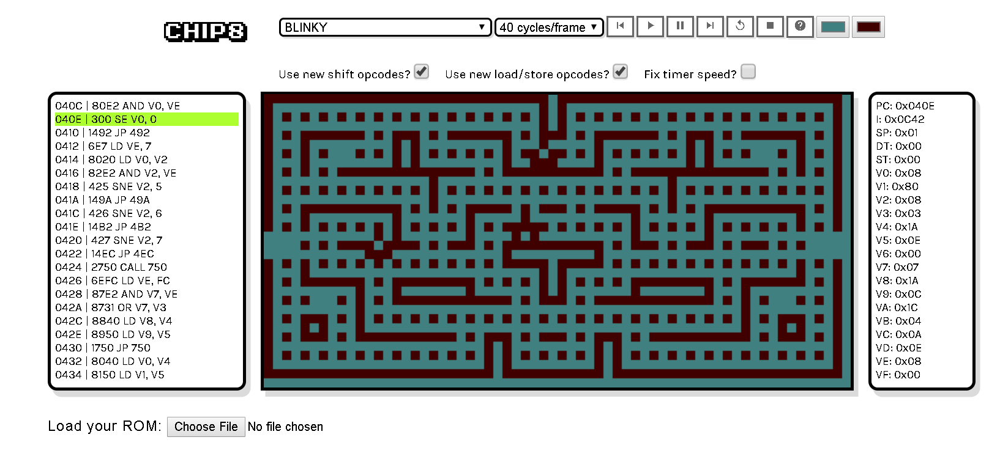
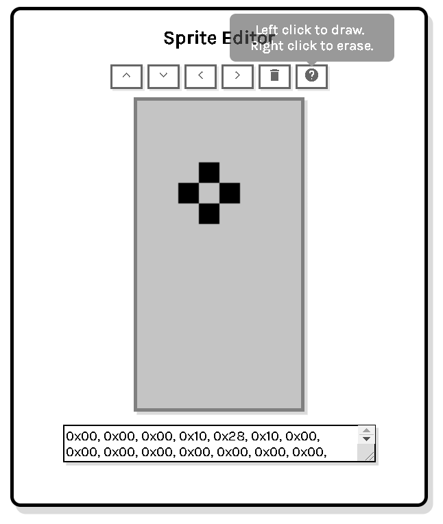

# Team 10 JS-Chip 8 Program

## Instructions:

### To run the webpage: 

1. Go to the `chip-8-webpage` folder, and open `index.HTML` in Google Chrome.
2. Select one of the ROMs from the drop-down menu to run. 
3. Load any chip8 rom via the `Load your ROM` button. We put legacy chip8 roms not written by us in a folder called `rom` and the roms written by us in the `games` folder.
4. While a program is running, the values of 21  registers will be displayed. A list of the latest 21 instructions is shown, and the current instruction highlighted in green. 
5. While a program is running user can: 
    - Pause the program 
    - Resume the program 
    - Step forward or backward one instruction at a time 
    - Reset the Emulator to its default state (screen background and pixel colour, and checkbox values will be preserved)
    - Restart the current ROM (i.e., the user doesn't have to reload their ROM using the `Load your ROM` button or re-select a preloaded ROM from the drop-down menu) 
    - Display the pop-up screen with description of the pre-load program selected from the drop-down menu and instructions on how to play the game.  
    - Change the Emulator's screen background and pixels colours
6. User can change the Emulator speed via the second drop-down, the default speed is 8 cycles/frames before or while the program runs. 
7. The `Use new shift opcodes` and `Use new load/store opcodes?` are added to support old ROMs. Please refer to the [list of known CHIP-8 programs that require special settings to run properly](https://github.com/tomdaley92/Kiwi8/issues/9) for more details. 
8. The `Fix timer speed?` checkbox is un-checked by default, user needs to check it to support the `Jumpy Rabbit` game. 

### For Jest Automated testing:

    a. Install [node.js](https://nodejs.org/en/), please also install `npm` while installing node.js on your local machine 

    b. un-zip `node_modules.zip`, the directory structure after un-zip node_modules.zip:

        cmpt276_chip8 
        |_____chip-8-webpage 
        |_____node_modules 
            |______folder1 
            |______folder2 ... 
        |_____other second-level subfolders 

    c. open the terminal

    d. type: `cd cmpt276_chip8/chip-8-webpage/tests`

    e. type: `npm run test`

### To run our game (`Space Wars`)
- Important for Space Wars: Please **UN-check the `Fix timer speed?` checkbox** before loading the rom.
- Controls:
    - At the title screen, **press and hold** `E` on your keyboard to start. 
    - `W` (move up), `S` (move down), `A` (move backward), `D` (move backward) keys are used for movement
    - `E` is used to shoot from your ship
    - When the game ends, press and hold `E` to restart the game.
- For more details, please refer to the `README.md` in the `games\game1` folder.

### To run our game (`Jumpy Rabbit`)
- Important for Jumpy Rabbit: Please set the speed to **40 cycles/frame** and **CHECK the `Fix timer speed?` checkbox** before loading the rom.
- Controls:
    - At the title screen, select the level difficulty by pressing `W` (up) or `D` (down) and then **press and hold** `E` on your keyboard to start. 
    - The `W` key makes your rabbit jump.
    - Make sure to avoid all obstacles! 
    - To win reach 20 points at level 1, 100 at level 2, and 255 at level 3!
    - If you win, congratulations and enjoy seeing Jumpy McRabbit make his way home. If you lose, no worries, just hold `E` to try again.
- For more details, please refer to the `README.md` in the `games\game2` folder.

### Chip 8 Tool (`Sprite Editor`)

- User scrolls down to reveal the Sprite Editor, scrolls up to hide it, the current state of the Sprite Editor will be fully preserved.
- User *left-clicks* on the screen area to turn pixels on or *right-clicks* to turn pixels off. The `Sprite Editor` will produce/update the corresponding hex values in the text box. To turn multiple pixels on/off, hold and drag the cursor. 
    - **Note**: Right-click-and-drag to turn multiple pixels off would require either a mouse or physical keys on the touchpad of a laptop. A touchpad without left and right keys would not be able to utilize this feature since most machines would recognize it as left-click-and-drag when you put two keys down and drag.
- User can edit the hex values displayed in the text box area and the corresponding sprite will be displayed on the screen. Please note that the text box recognizes input in 'comma-delimited' hex format with required `0x` prefix.
- User can also:
    - Reset the `Sprite Editor` (clear the screen and set the hex values to 0x00)
    - Move the existing sprites up/down/left/right (wrap around)
