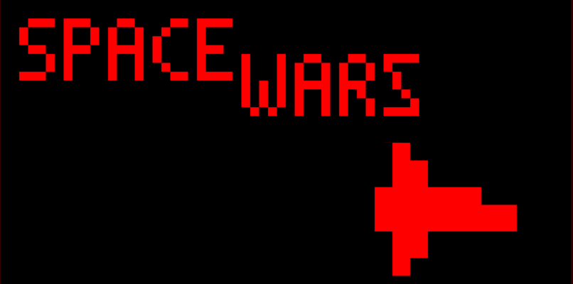

# **SpaceWars!**
___
## Introduction
Welcome to SpaceWars, a game developed by team 10 which is based on the Atari classic game 'Outlaw'. This game was developed using the open source high-level assembler called [Octo by John Earnest](https://github.com/JohnEarnest/Octo)

## How to play
SpaceWars is currently in the prototype stage, there may still be bugs present in the game. To play this game simply download either the octo file (.8o) or chip-8 file (.ch8) and load it onto a chip-8 emulator. While our emulator is being developed, we reccommend you use the [Octo emulator](http://johnearnest.github.io/Octo/).

SpaceWars is a shoot-out style game that puts you up against an Ai opponent in a best of 5 series. At the title screen, press and hold 'E' on your keyboard to start.

**Controls are as follows**:
- W,S,A,D keys are used for movement
- E is used to shoot from your ship

## Future Releases
The team is currently in the planning phase for what is to come next for SpaceWars. The following is being considered: Special abilities accessable by the player, randomized (or near random) playing field, and alternative movement which would make the ships glide more.

