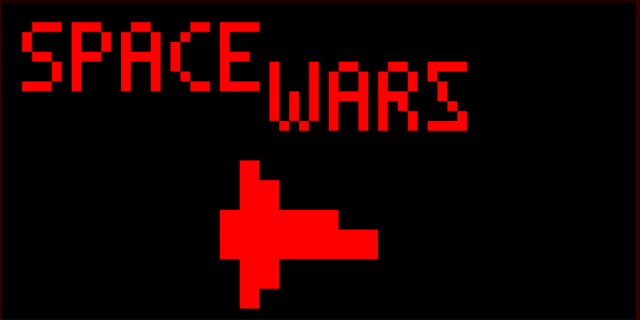
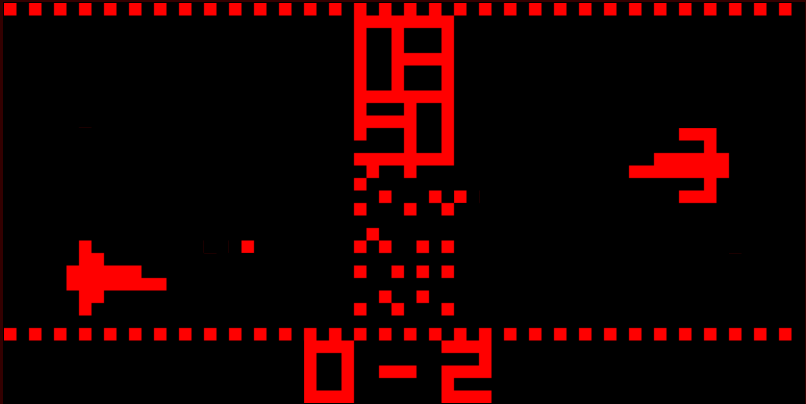
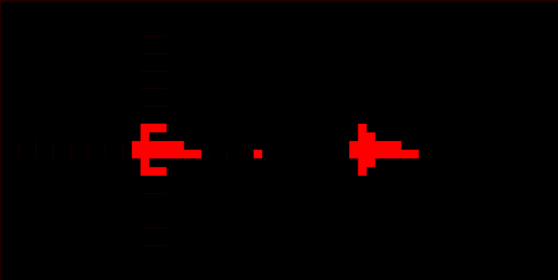

# **SpaceWars!**
___
## Introduction
Welcome to SpaceWars, a game developed by team 10 which is based on the Atari classic game 'Outlaw'. This game was developed using the open source high-level assembler called [Octo by John Earnest](https://github.com/JohnEarnest/Octo)

## How to play
To play this game simply download the  chip-8 file (.ch8) and load it onto our chip-8 emulator. The recommended speed for this game is 30-40 cycles per frame.

SpaceWars is a shoot-out style game that puts you up against an Ai opponent in a best of 5 series. The objective of the game is to destroy the enemy before they destroy you! You can shoot the field infront of you to create a path. Beware, if you and your enemy's lasers hit each other, it creates debris.

**Controls**:
- At the title screen, **press and hold** 'E' on your keyboard to start. 
- W (move up), S (move down), A (move backward), D (move backward) keys are used for movement
- E is used to shoot from your ship
- When the game ends, press and hold 'E' to restart the game.

## Latest release notes
- Fixed major game-breaking bug (stack overflow)
- Added randomized playing field
- Added game over animation and final screen.
- Player choice to play a new game no longer shows initial title screen, instead just a new score of 0 - 0.

## Screenshots

